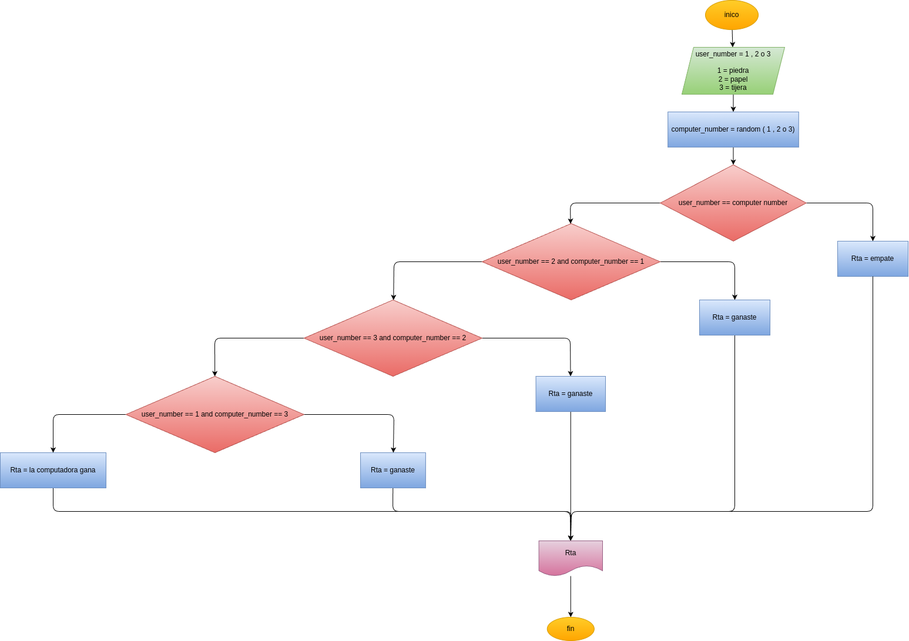

# Piedra-papel-o-tijera
Programa en Python del mítico juego de piedra papel o tijera.

## Análisis

### Varables de entrada
user_number = (1,2 ó 3)

### Procesamiento
if(computer_number == user_number):

    print(" ")
    print("empate")
elif((user_number == 3 and computer_number == 2)or

(user_number == 1 and computer_number == 3)or

(user_number == 2 and computer_number == 1)):

    print(" ")
    print("ganaste")
else:

    print(" ")
    print("la computadora gana")

## Diseño

